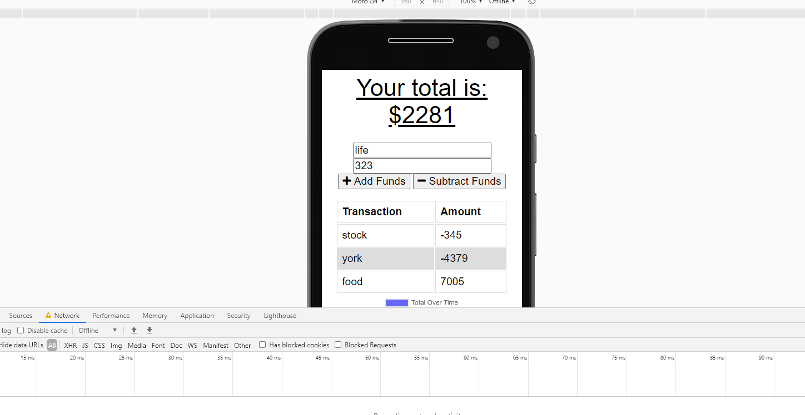
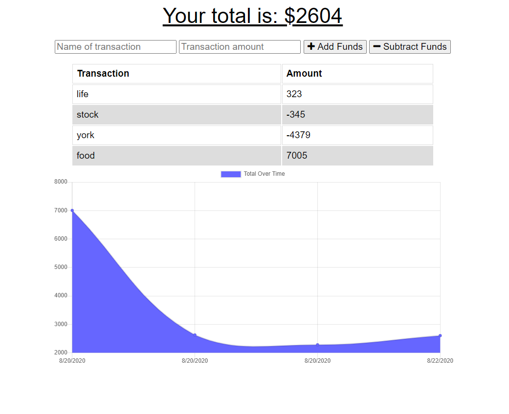

# PWA Budget Tracker App

The Budget Tracker is a progressive web application that enables the user to track their finances with, or without internet connection.

## Technologies Used 

* HTML
* CSS 
* Javascript 
* Node.js 
* Express.js 
* MongoDB 
* Mongoose 
* IndexedDB
* Server Workers 
* Cache API 

## Table of Contents 

1. [Description](#Description)
2. [Installation](#Installation)
3. [Usage](#Usage)
4. [Testing](#Testing)
5. [Screenshots](#Screenshots)

## Description 

This progressive web application has offline functionality by utilizing Service Workers and the Cache API to store static files and API responses in the users local cache. While offline, they may add an expense or deposit, which is stored in their local IndexedDB. When the app changes back to "online" then all offline transactions will get posted from their IndexedDB database to their MongoDB database. The total budget is then updated and the users IndexedDB pending object store is cleared.

## Installation 

* Clone the repository to your local device 
* Install the necessary npm packages by typing the following command in the terminal:

```
npm install
```

## Usage 

* This app is simple to run and is set up to us port 8080 for local running. Start the program in terminal with the code below:
```
npm start
```

* Another way to run this App would be to navigate to the deployed [Heroku site](https://budget-tracker-jl.herokuapp.com/)

## Testing

* Enter a transaction name and amount, choose whether the transaction is a deposit (add funds) or an expense (subtract funds).
* View a table containing past transactions.
* While offline you may continue to view the application and add transactions.
* When internet connectivity is detected, your total budget will update reflecting the added transactions from when app was offline
* Testing Offline Capabilities:
    * Open your browsers' Dev Tools
    * Click Network
    * Click the arrow button next to "Online"
    * Click "Offline"


## Screenshots



